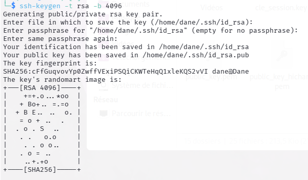
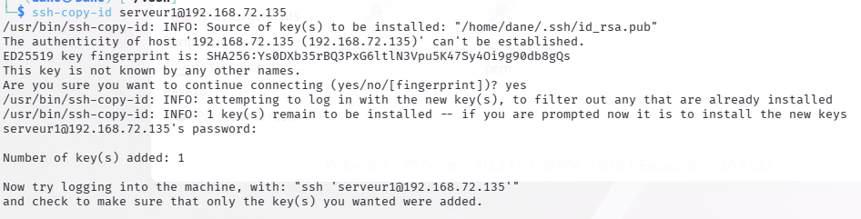
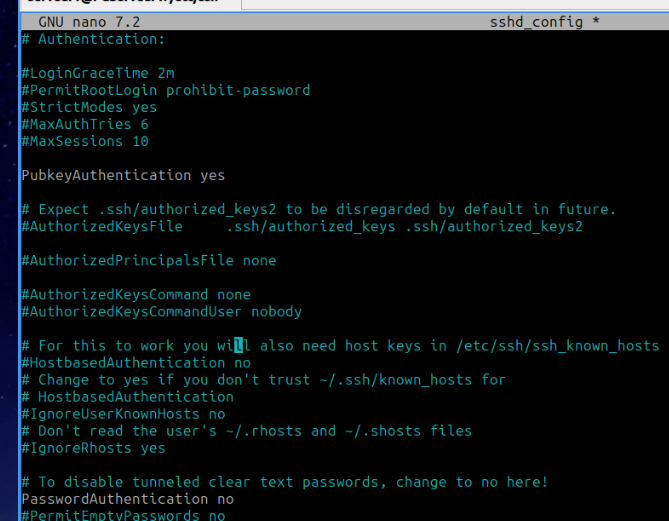
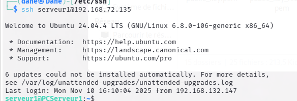
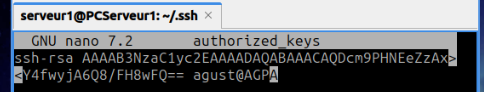
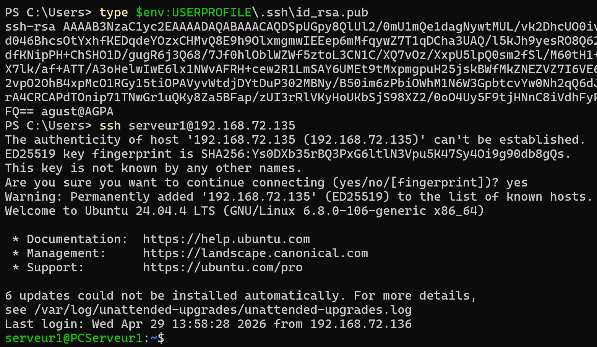

# TP3 Clés ssh 

# I. Configuration initiale 
## Génération de la clé SSH 

• Paire des clés RSA 4096 - Fichiers générés :

## Dépôt de la clé publique dans le serveur distant 

• `id_rsa.pub` dans le home de l'utilisateur 

## Configuration du serveur pour forcer l’authentification par clé

• Fichier de configuration ssh pour forcer l’authentification par clé uniquement 

• Redémarrage du service SSH pour appliquer la configuration : 

`serveur1@PCServeur1:/etc/ssh$ systemctl restart ssh`

# II. Validation du fonctionnement 

• Connection au serveur sans mot de passe à l’aide de la clé privée :

• Questions : 

- Ce qui se passe si je supprimez la clé privée :

Si je supprimes ma clé privée et que le serveur n'accepte que les clés je reste bloqué dehors. La clé publique sur le serveur devient inutile sans la clé privée correspondante. 

  - Solutions possible : réactiver temporairement les mots de passe en éditant le fichier sshd_config en éditant l'argument "PasswordAuthentication yes".

# III.  Bonus 

## Activation et utilisation de ssh-agent 

- Le rôle de ssh-agent :

        C'est un programme qui tourne en arrière-plan et garde la clé privée déverrouillée en mémoire pendant une session. Si la clé privée a une passphrase, elle n'a à être saisie qu'une seule fois au démarrage, l'agent s'occupe ensuite de signer les connexions suivantes automatiquement, sans jamais exposer la clé privée elle-même.

• Configurez et testez ssh-agent Sur l’OS Windows

- Ajout de la clé Publique de mon PC Windows dans le fichier "Authorized_keys" de mon serveur :

Recuperation de la clé + Test de connexion et ajout du serveur dans "known hosts"

