# TP4 RockYou John

# Cracker des hash de différents types 

### Basique 

- **Hash_ID pour identifier le type de hash :**


- **Hashs crackes avec JohnTheRipper :**
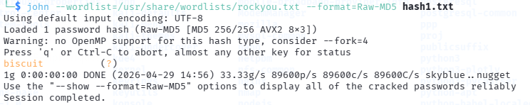
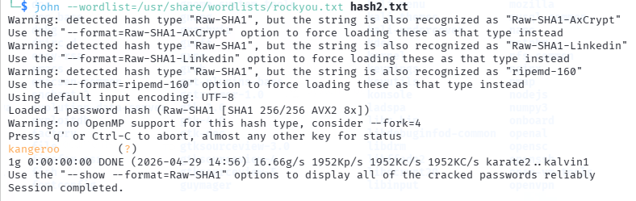
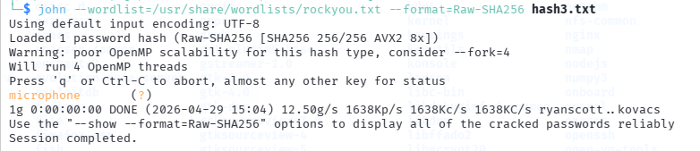
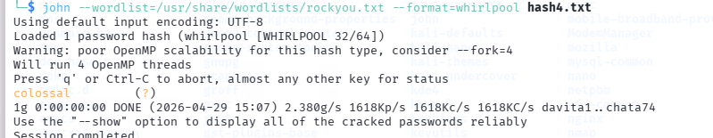

### Authentification Windows 

```
Note :

hash-identifier fait de la détection par pattern (longueur + caractères) — il ne peut pas distinguer MD5, NTLM, MD4 car il fait tous les trois 32 caractères hexadécimaux. C'est visuellement identique.
La différence est dans l'algorithme de calcul, pas dans l'apparence du hash. Donc les outils de détection donnent une liste de possibilités plutôt qu'une certitude.
Pour NTLM spécifiquement, le contexte aide beaucoup :

Hash vient d'un système Windows → probablement NTLM
Hash vient d'une base de données web → probablement MD5
Hash vient de /etc/shadow Linux → MD5crypt ou SHA512crypt

```
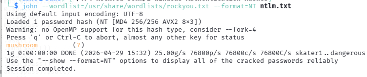

### /etc/shadow 

Essai sans format spécifique :

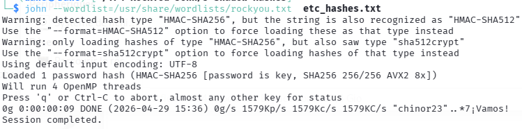

Ce qui a fonctionné :

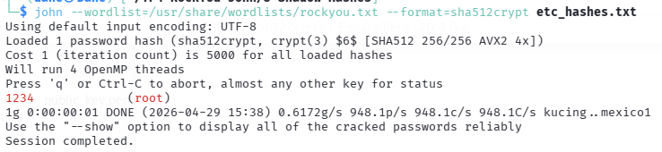

```
Explication :

Sur Linux, l'authentification utilise deux fichiers séparés :

/etc/passwd (local_passwd)

Contient les infos des utilisateurs : nom, UID, GID, shell, home
Lisible par tout le monde
Le x dans le champ mot de passe signifie "le hash est dans shadow"


/etc/shadow ( local_shadow)

Contient les hash des mots de passe
Lisible par root seulement (c'est là la sécurité)
Le $6$ = SHA512crypt, $1$ = MD5crypt, $2b$ = bcrypt


Pourquoi deux fichiers ?
Historiquement tout était dans passwd — mais comme il est lisible par tous, n'importe qui pouvait récupérer les hashs et les cracker offline. shadow a été créé pour isoler les hashs avec des permissions strictes.

Pour John, il faut les combiner avec unshadow :

unshadow local_passwd local_shadow > combined.txt

john --wordlist=/usr/share/wordlists/rockyou.txt combined.txt

C'est exactement ce que contient etc_hashes.txt — les deux fichiers déjà combinés.
```
### Single Crack

Comment ça fonctionne :

--rules applique des transformations automatiques sur chaque mot de la wordlist :

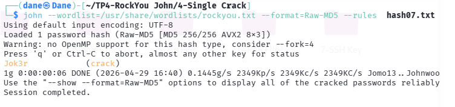

### Fichiers Zip protégés par mot de passe 

Conversion .zip en .txt avec l'outil **zip2john** :

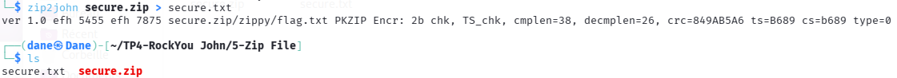

Résultat :

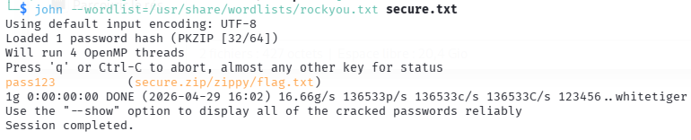

### Fichiers RAR protégés par mot de passe 

Conversion .rar en .txt avec l'outil **rar2john** :

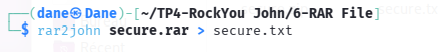

Résultat :

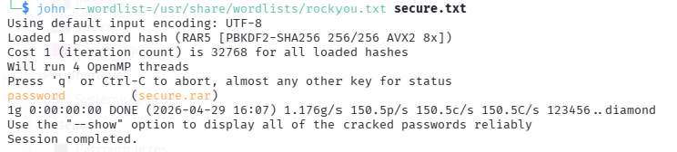

### Clés SSH  

Conversion du fichier id_rsa en .txt avec l'outil **ssh2john** et résultat : 

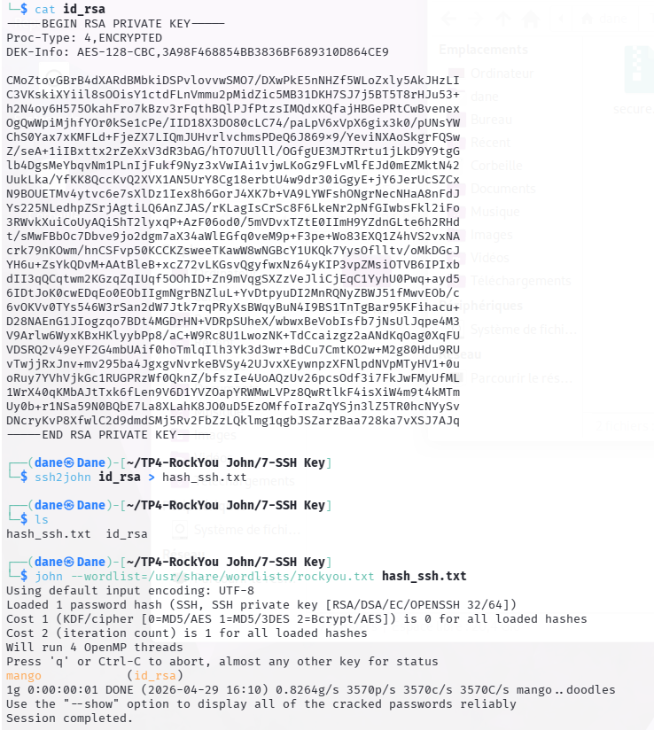


